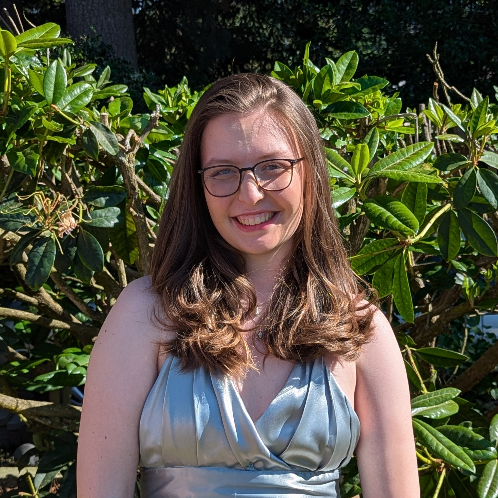

# About Me

Hello! My name is Elliot Krawczyk. I study at the *University of Washington*. This page says a little about me.

## Academics

I am majoring in Computer Science and Statistics. I am currently enrolled in **ENGL396: Software Documentation**. When I graduate, 
I plan to become a software engineer or IT specialist

Here is a list of my favorite classes at UW:

- [Programming Languages](https://courses.cs.washington.edu/courses/cse341/index.html)
- [Quantitative Introductory Stats for Data Science](https://stat.uw.edu/academics/course-catalog/stat-391)
- [Software Documentation](https://english.washington.edu/courses/2025/spring/engl/396/a)

## Programming Background

I have some experience with programming, starting with college classes in highschool. The following table summarizes my experience with different programming languages:

| Language | Experience |
|---------:|------------|
| *Java*     | Proficent. I have taken many Java classes  |
|  *HTML*    | Authored a personal webpage    |
|  *C++*     | Took one C++ class in highschool       |

## Words of Wisdom

One of my favorite quotes is from The Stormlight Archive book series by Brandon Sanderson. 

> "Sometimes a hypocrite is just a man in the process of changing."

## Other projects

[More about me!](about.html)

[My personal website](https://students.washington.edu/ekraw/)
